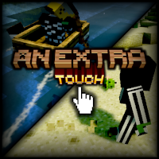

# An Extra Touch

Various small visual, audio, and gameplay tweaks, aimed to enhance the game experience. For Minecraft 1.7.10.

## Features

* [Footprints](https://github.com/JackOfNoneTrades/AnExtraTouch/wiki/Footprints): tracks left by players and mobs, with per-entity sizing and surface rules.
* [Entity effects](https://github.com/JackOfNoneTrades/AnExtraTouch/wiki/Entity-effects): cold breath, dripping wet entities, and cake crumbs.
* [Sounds](https://github.com/JackOfNoneTrades/AnExtraTouch/wiki/Sounds): enhanced thunder, armor walking and equip sounds, wet footsteps in rain, and optional muting of Dynamic Surroundings animal ambience.
* [Water effects](https://github.com/JackOfNoneTrades/AnExtraTouch/wiki/Water-effects): water and lava splashes, waterfall foam and ambience, chest bubbles, rain ripples, and Wakes trails with swimming ripples.
* [Coastal Waves](https://github.com/JackOfNoneTrades/AnExtraTouch/wiki/Coastal-Waves): shore waves and breaking sounds.
* [Camera Overhaul](https://github.com/JackOfNoneTrades/AnExtraTouch/wiki/Camera-Overhaul): movement tilt, idle sway, and configurable camera shakes, including sound triggers.
* [Shoulder Surfing additions](https://github.com/JackOfNoneTrades/AnExtraTouch/wiki/Shoulder-Surfing): decoupled camera, aiming transitions, player fading, smooth follow, and omnidirectional sprinting.
* [Smooth GUI and loading screen](https://github.com/JackOfNoneTrades/AnExtraTouch/wiki/Smooth-GUI): animated menus and the Loading Progress Bar port.
* [Gameplay](https://github.com/JackOfNoneTrades/AnExtraTouch/wiki/Gameplay): modern boat controls, optional grass trampling, and Thermal Foundation Blizz snow trails.

See the [configuration guide](https://github.com/JackOfNoneTrades/AnExtraTouch/wiki/Configuration) and category pages for all settings.

This mod can be installed on client, server, or both. Armor walking sounds are more precise when the mod is installed on the server.

## Dependencies

* [UniMixins](https://modrinth.com/mod/unimixins)    
* [GTNHLib](https://modrinth.com/mod/gtnhlib)      
* [FentLib](https://www.curseforge.com/minecraft/mc-mods/fentlib)    

## Building

`./gradlew build`.

## Credits

* [Dynamic Surroundings](https://github.com/OreCruncher/DynamicSurroundingsFabric). Armor sound assets and footprint texture come from this mod.
* [LegendarySurvivalOverhaul](https://github.com/Alex-Hashtag/LegendarySurvivalOverhaul).
* [Smooth Gui](https://github.com/Ezzenix/SmoothGui)
* [Minecraft-CameraOverhaul](https://github.com/Mirsario/Minecraft-CameraOverhaul)
* [Shoulder Surfing](https://github.com/Exopandora/shouldersurfing)
* [Particular](https://github.com/Chailotl/particular). Source of cascade, splash, ripple, chest bubble, and cake particle effects and textures.
* [Wakes](https://github.com/Goby56/wakes). Source of the water trail effect and textures.
* [Coastal Waves](https://www.curseforge.com/minecraft/mc-mods/coastal-waves) by Verph. Source of the shore wave effect, textures, and sounds.
* [Crest Ocean System](https://github.com/wave-harmonic/crest). Coastal foam simulation and shared coastal/wake foam appearance and texture.
* [Et Futurum Requiem](https://github.com/Roadhog360/Et-Futurum-Requiem).
* [Loading Progress Bar](https://github.com/jbredwards/Loading-Progress-Bar). Mixin port thanks to [kotmatross28729](https://github.com/kotmatross28729).
* [GT:NH buildscript](https://github.com/GTNewHorizons/ExampleMod1.7.10).

## License

`LGPLv3`.

* [Dynamic Surroundings assets and code are licensed under MIT](https://github.com/OreCruncher/DynamicSurroundingsFabric/blob/main/LICENSE).
* [Legendary Survival Overhaul assets and code are licensed under LGPL 2.1](https://github.com/Alex-Hashtag/LegendarySurvivalOverhaul/blob/1.21.1/LICENSE.txt).
* [Smooth Gui code is licensed under CC0-1.0](https://github.com/Ezzenix/SmoothGui/blob/main/LICENSE).
* [Minecraft-CameraOverhaul code is licensed under GPL-3.0](https://github.com/Mirsario/Minecraft-CameraOverhaul/blob/dev/LICENSE.md)
* [Shoulder Surfing code is licensed under MIT](https://github.com/Exopandora/ShoulderSurfing/blob/master/LICENSE)
* [Particular assets and code are licensed under LGPL-3.0](https://github.com/Chailotl/particular/blob/master/LICENSE).
* [Wakes assets and code are licensed under GPL-3.0](https://github.com/Goby56/wakes/blob/main/LICENSE).
* [Crest foam code and texture are licensed under MIT](https://github.com/wave-harmonic/crest/blob/db0658ff0b2e93e4a9e28cc2867509658b0ecc00/LICENSE).
* [Coastal Waves](https://www.curseforge.com/minecraft/mc-mods/coastal-waves) assets and code are copyright Verph and licensed under BSD 2-Clause. `Waves-1.21.x-1.6.1.jar` metadata contains the BSD 2 license (`license = "BSD 2"`).
* [Et Futurum Requiem code is licensed under LGPL-3.0](https://github.com/Roadhog360/Et-Futurum-Requiem/blob/master/LICENSE).
* [Loading Progress Bar code is licensed under MIT](https://github.com/jbredwards/Loading-Progress-Bar/blob/1.7.10/LICENSE)

Waterfall recording credits and licenses are listed in [WATERFALL_SOUND_CREDITS.txt](src/main/resources/assets/anextratouch/WATERFALL_SOUND_CREDITS.txt).

## Buy me some creatine

* [ko-fi.com](https://ko-fi.com/jackisasubtlejoke)
* Monero: `893tQ56jWt7czBsqAGPq8J5BDnYVCg2tvKpvwTcMY1LS79iDabopdxoUzNLEZtRTH4ewAcKLJ4DM4V41fvrJGHgeKArxwmJ`

 

